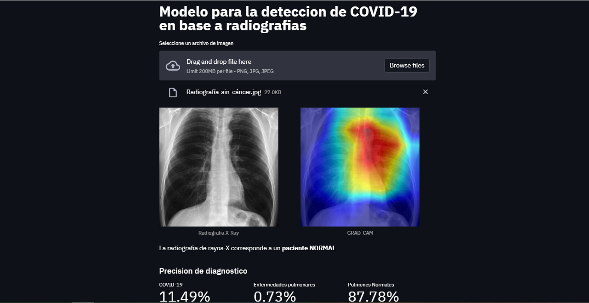
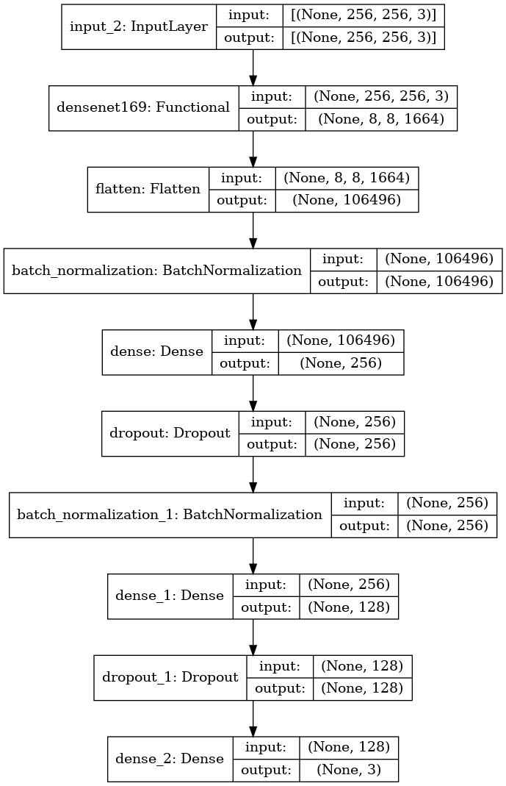

## Sistema Web para la deteccion de COVID-19 a partir de radiografias de rayos-X [Link](https://share.streamlit.io/jovamih/covid19detectorapp/main/app.py)

Version Streamlit del despliegue de la aplicacion web  para la deteccion de COVID19 a partir de radiografias.

* La arquitectura del modelo de Redes neuronales convolucionales

### Metodologia CRISP-DM empleada

* Proyecto  principal de inicio a fin: [Click Here!](https://github.com/Jovamih/Modelo-Deteccion-COVID19)

### Autor: Johan Valerio mitma huaccha.
* Dedicado a mi madre : *Isabel huaccha fernandez*
